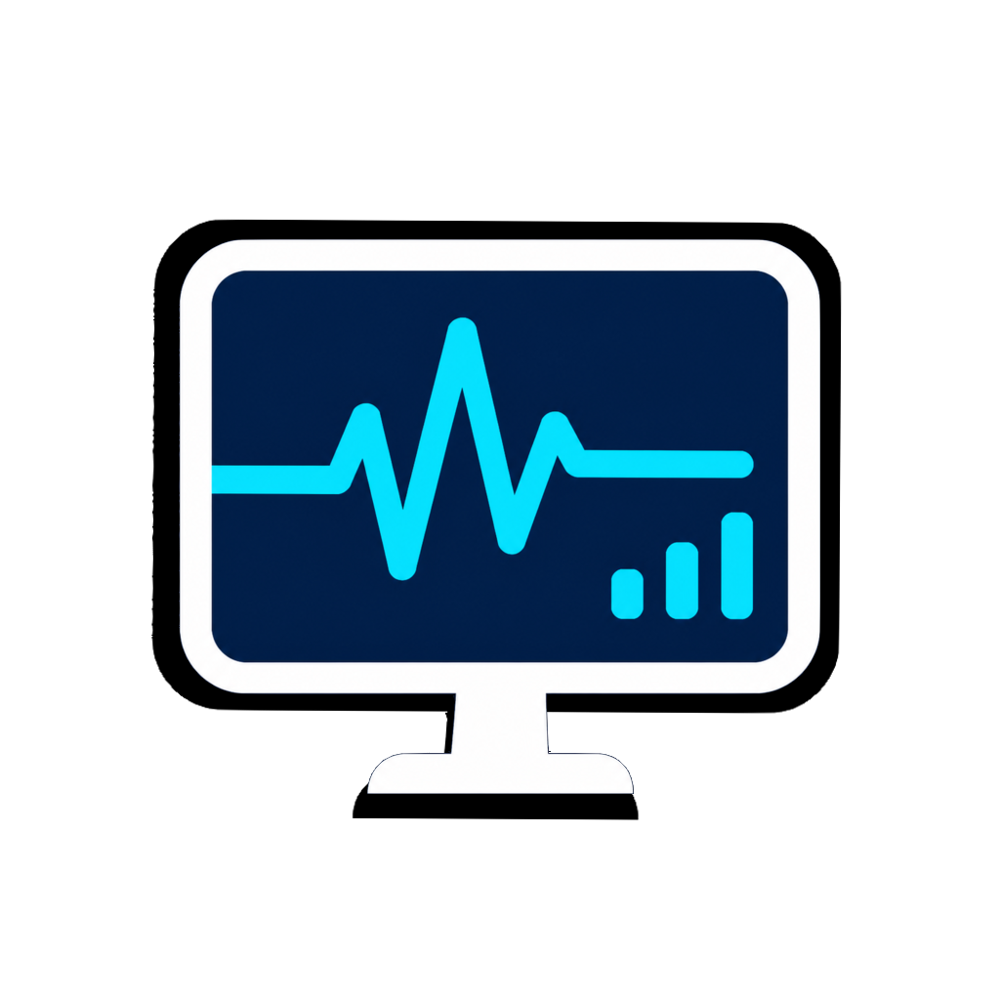
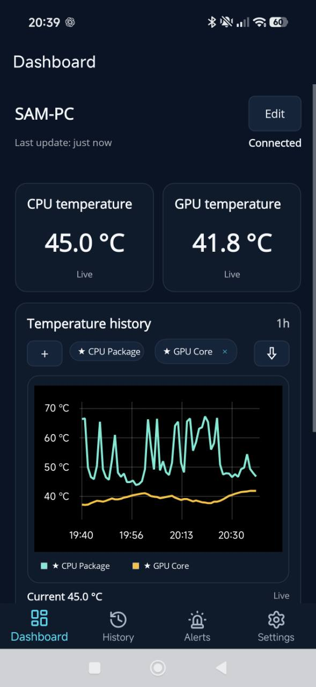
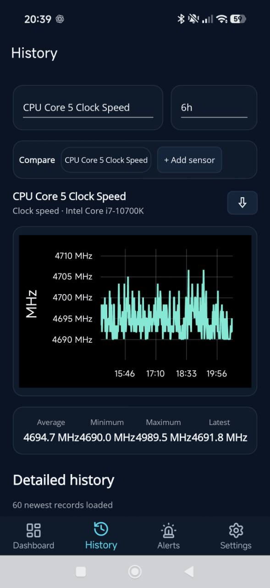
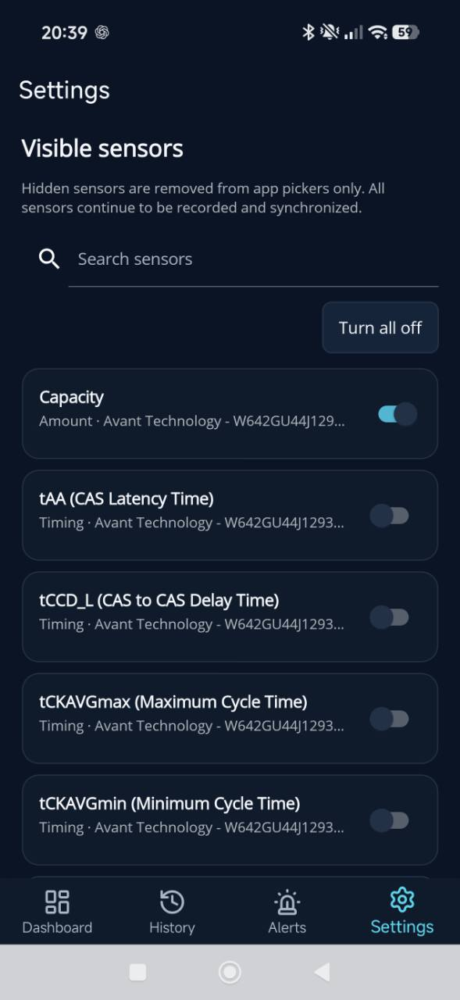
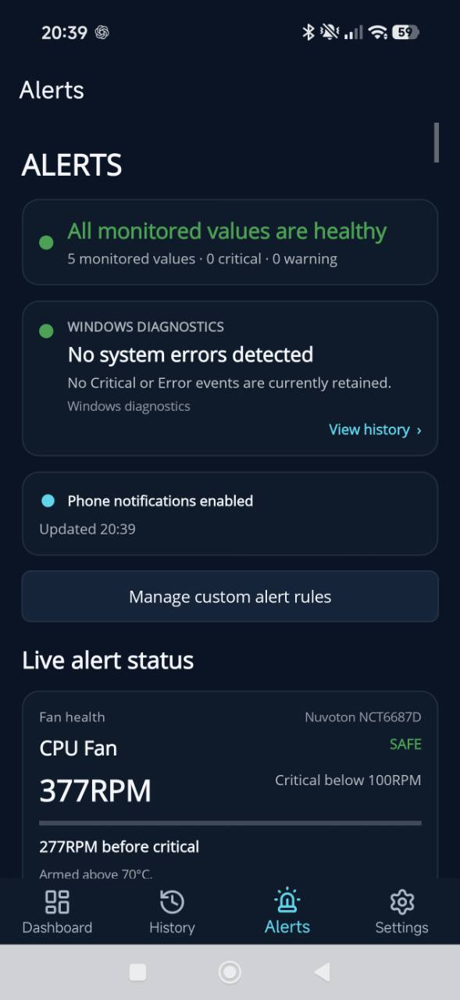
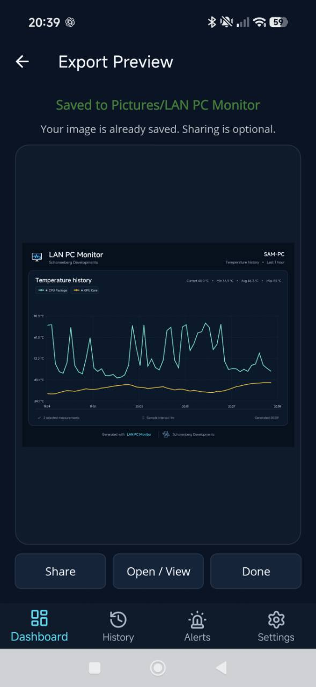
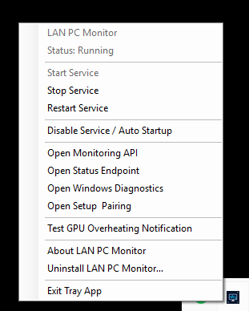

<div align="center">
  

  <h1>LAN PC Monitor</h1>

  **Monitor your Windows PC from your Android phone over your local network, without a cloud monitoring service.**

  View hardware sensors, history, alerts, diagnostics, and load sessions from an Android device on the same network.

  <br>

  <a href="https://github.com/sam-schonenberg/lan-pc-monitor/releases/latest">
    
  </a>
  <a href="LICENSE.txt">
    
  </a>
  
  
</div>

> [!NOTE]
> **LAN PC Monitor is currently entering alpha testing, and Android testers are welcome.**
>
> The Android app is available through a private Google Play testing track. If you would like to test the app, report bugs, suggest features, or follow development, join the Schonenberg Developments Discord server.
>
> [**Join the Discord server**](https://discord.gg/XU6YsJRf)

<br>

<p align="center">
  
  &nbsp;&nbsp;
  
</p>

<p align="center">
  <strong>Live monitoring</strong> ·
  <strong>Historical graphs</strong> ·
  <strong>Alerts</strong> ·
  <strong>Diagnostics</strong> ·
  <strong>Session tracking</strong>
</p>

LAN PC Monitor consists of a Windows monitoring service and a companion Android app.

The Windows service reads supported hardware sensors and stores monitoring data locally. The Android app connects directly to the PC over your local network so you can check readings from your phone.

Use it to watch temperatures while gaming, investigate a crash, compare sensor history, or check for unusual activity while you were away.

## What you can do

### Live monitoring

See current CPU, GPU, memory, temperatures, clocks, fans, power usage, and other supported sensors from your Android device.

Choose which sensors appear on the dashboard.

<p align="center">
  
</p>

### Sensor history

LAN PC Monitor stores recent sensor history locally. Review changes in temperatures, utilization, memory usage, and other values over time when troubleshooting crashes, thermal issues, or unusual performance.

### Alerts and diagnostics

Configure alerts for individual sensors and review diagnostic information when something looks wrong.

The app also shows relevant Windows diagnostic events so you can compare sensor behavior with crashes or hardware and driver problems.

<p align="center">
  
</p>

### Export graphs for troubleshooting

Export historical graphs as images to share monitoring data when asking for help.

<p align="center">
  
</p>

## Background monitoring

The Windows component runs as a background service and continues collecting data when the Android app is disconnected.

A notification-area companion provides access to setup and service controls.

<p align="center">
  
</p>

## Local network communication

Your Windows PC and Android device communicate directly over the local network.

Monitoring, pairing, live dashboards, and history synchronization stay on your local network. No account is required, and the project does not collect telemetry.

Optional critical notifications use the internet. When enabled, the service sends a size-limited alert through the notification relay and Firebase Cloud Messaging to reach your phone.

## Install and connect

### 1. Install the Windows monitor

[**Download the latest Windows installer from GitHub Releases**](https://github.com/sam-schonenberg/lan-pc-monitor/releases/latest)

Open the release's **Assets** section and download the Windows `.msi` installer. Run the installer as an administrator.

It installs:

- the background monitoring service;
- the signed PawnIO hardware-access driver required for supported CPU and motherboard sensors;
- the notification-area companion;
- a Start Menu shortcut; and
- a Windows Firewall rule limited to the local subnet.

The setup completion page opens the PC's local pairing page. Windows may show an unknown-publisher warning while public code signing is not configured.

See [Installer and updates](docs/INSTALLER.md) for detailed behavior and verification.

### 2. Install the companion app

The Android app is currently available through a private Google Play testing track. Prebuilt APK files are not distributed through GitHub.

To request tester access, join the Schonenberg Developments Discord server:

[**Join the Discord server**](https://discord.gg/XU6YsJRf)

The Android app is only a viewer; the Windows monitor must be installed and running on the PC.

### 3. Connect

Keep the phone and PC on the same local network, open the app, and scan the QR code shown by the PC's setup page.

You can also enter the PC address manually, for example:

```text
http://192.168.1.50:5005
```

Guest Wi-Fi isolation, VPN routing, or another firewall can prevent devices on the same Wi-Fi from reaching each other.

## Feature overview

- Human-readable CPU, GPU, memory, fan, power, voltage, and temperature labels.
- Live readings updated about once per second.
- A customizable dashboard with current values, graphs, and alerts.
- Local minute-by-minute history with hour, day, and longer-range charts.
- Sustained temperature warnings and critical alerts with hysteresis.
- Custom above/below alert rules for individual sensors.
- Optional critical push notifications, enabled from the app's Settings page.
- CPU/GPU load-session detection and per-session statistics.
- Windows diagnostic and driver event information.
- Exportable historical graphs for troubleshooting and sharing.
- Offline access to history already synchronized to the app.
- Local storage with configurable retention and no telemetry.

The exact sensor set depends on the PC's hardware, drivers, permissions, and [LibreHardwareMonitor](https://github.com/LibreHardwareMonitor/LibreHardwareMonitor) support.

## How it works

| Component | Role |
|---|---|
| Windows service | Reads hardware sensors, records history, evaluates alerts, and exposes the LAN API. |
| Android app | Displays live readings, dashboards, alerts, diagnostics, and synchronized offline history. |
| Tray companion | Opens the pairing page and provides access to service and notification controls. |
| Notification relay | Forwards opt-in critical alerts to Firebase; it cannot connect to the PC and stores no alert history. |

### Privacy

Monitoring, pairing, live dashboards, and history synchronization stay on the local network and require no account.

There is no telemetry. Monitoring data is stored under `%ProgramData%\LanPcMonitor` on the PC, while the app keeps synchronized history and preferences in its private local database.

During detected load sessions, process monitoring retains only normalized process names such as `game.exe` and aggregate CPU statistics. It does not retain paths, command lines, window titles, documents, memory contents, or network activity.

Push notifications are the only feature that uses an internet service. After you enable them in **Settings**, the Windows service sends a size-limited alert to the hosted relay, which forwards it through Firebase Cloud Messaging. The relay cannot access or control the monitored PC and does not receive sensor history.

Notifications can be disabled again from the app. See the [notification relay and privacy boundary](docs/NOTIFICATION_RELAY.md).

> [!IMPORTANT]
> The current LAN API uses unencrypted HTTP and WebSockets without authentication. Install LAN PC Monitor only on a trusted local network. Never forward port `5005` or expose it directly to the internet.

Read the full [security model](docs/SECURITY.md) before using the service on a shared or untrusted network.

## Requirements

### For alpha testing

- x64 Windows 10 or Windows 11 for the monitoring service;
- an Android device with access to the private Google Play testing track; and
- both devices on the same reachable local network.

### For development

- [.NET 10 SDK](https://dotnet.microsoft.com/download/dotnet/10.0);
- the .NET MAUI Android workload for Android builds; and
- administrator access for service and firewall testing.

## Build from source

```powershell
git clone https://github.com/sam-schonenberg/lan-pc-monitor.git
cd lan-pc-monitor
dotnet restore .\PCMonitor.Service.slnx
dotnet run --project .\PCMonitor.Service\PCMonitor.Service.csproj
```

The service listens on all local interfaces on port `5005` by default.

Useful endpoints:

- Setup and pairing: <http://localhost:5005/setup>
- Service status: <http://localhost:5005/api/v1/status>
- Current sensors: <http://localhost:5005/api/v1/sensors>
- Public v1 contract and integration guide: [API documentation](docs/API.md)
- Machine-readable OpenAPI 3.1 document: `http://<pc-address>:5005/openapi/v1.json`

Use `http://`, not `https://`; TLS is not configured in this release.

### Test

```powershell
dotnet build .\PCMonitor.Service.slnx --configuration Release
dotnet test .\PCMonitor.Service.Tests\PCMonitor.Service.Tests.csproj --configuration Release
dotnet test .\PCMonitor.Application.Tests\PCMonitor.Application.Tests.csproj --configuration Release -f net10.0-windows10.0.19041.0
```

### Package builds

Build the Android client:

```powershell
dotnet build .\PCMonitor.Application\PCMonitor.Application.csproj --configuration Release -f net10.0-android
```

Build the self-contained Windows MSI:

```powershell
.\scripts\build-installer.ps1 -Version 0.2.0
```

Release maintainers should follow the [release checklist](docs/RELEASING.md).

## Service configuration

Defaults live in [`PCMonitor.Service/appsettings.json`](PCMonitor.Service/appsettings.json). An installed copy is preserved across upgrades, so local changes are not overwritten.

| Section | Controls |
|---|---|
| `Monitoring` | Hardware polling interval. |
| `SessionDetection` | CPU/GPU load thresholds and timing. |
| `HistoricalMonitoring` | Bucket duration, retention, and API limits. |
| `ProcessMonitoring` | Dominant-process sampling during load sessions. |
| `Alerts` | Temperature thresholds, hysteresis, and retention. |
| `Notifications` | Hosted relay, minimum push severity, delivery interval, and enable/disable state. |
| `Server` | LAN API port; default `5005`. |
| `Setup` | Optional app-store links on the pairing page. |

If you change the service port, update the firewall rule to match:

```powershell
.\scripts\install-firewall-rule.bat 5010
```

These settings usually do not need editing. Enable phone notifications in the Android app under **Settings → Critical notifications**; no Firebase project or relay configuration is required.

## Alpha limitations

LAN PC Monitor is available for use as pre-release software. Expect bugs, and verify alerts and readings against your hardware before relying on them.

Current limitations include:

- the monitoring service is Windows-only and the installer is x64-only;
- the LAN API has no authentication, pairing authorization, TLS, or rate limiting;
- QR setup uses the PC's current private IP address; automatic mDNS rediscovery is not implemented;
- a sudden crash can lose the unfinished current history bucket;
- Windows packages are not yet Authenticode-signed;
- the Android app is available only through the private Google Play testing track; and
- updates are installed manually; there is no in-app update checker.

## Documentation

- [API reference](docs/API.md)
- [Installer and updates](docs/INSTALLER.md)
- [Security and safe deployment](docs/SECURITY.md)
- [Notification relay architecture](docs/NOTIFICATION_RELAY.md)
- [Release checklist](docs/RELEASING.md)
- [v0.2.0 release notes](docs/RELEASE_NOTES_0.2.0.md)

## Contributing

Focused issues and pull requests are welcome.

Please keep the API backward-compatible where practical, add tests for behavioral changes, and do not introduce telemetry or outbound services without an explicit design discussion and opt-in model.

Report security concerns privately through GitHub Private Vulnerability Reporting rather than a public issue.

## Community

Questions, feedback, testing discussions, and feature suggestions are welcome in the Schonenberg Developments Discord server.

[**Join the Discord server**](https://discord.gg/XU6YsJRf)

## License

Copyright © 2026 Schonenberg Developments. Distributed under the [MIT License](LICENSE.txt).
