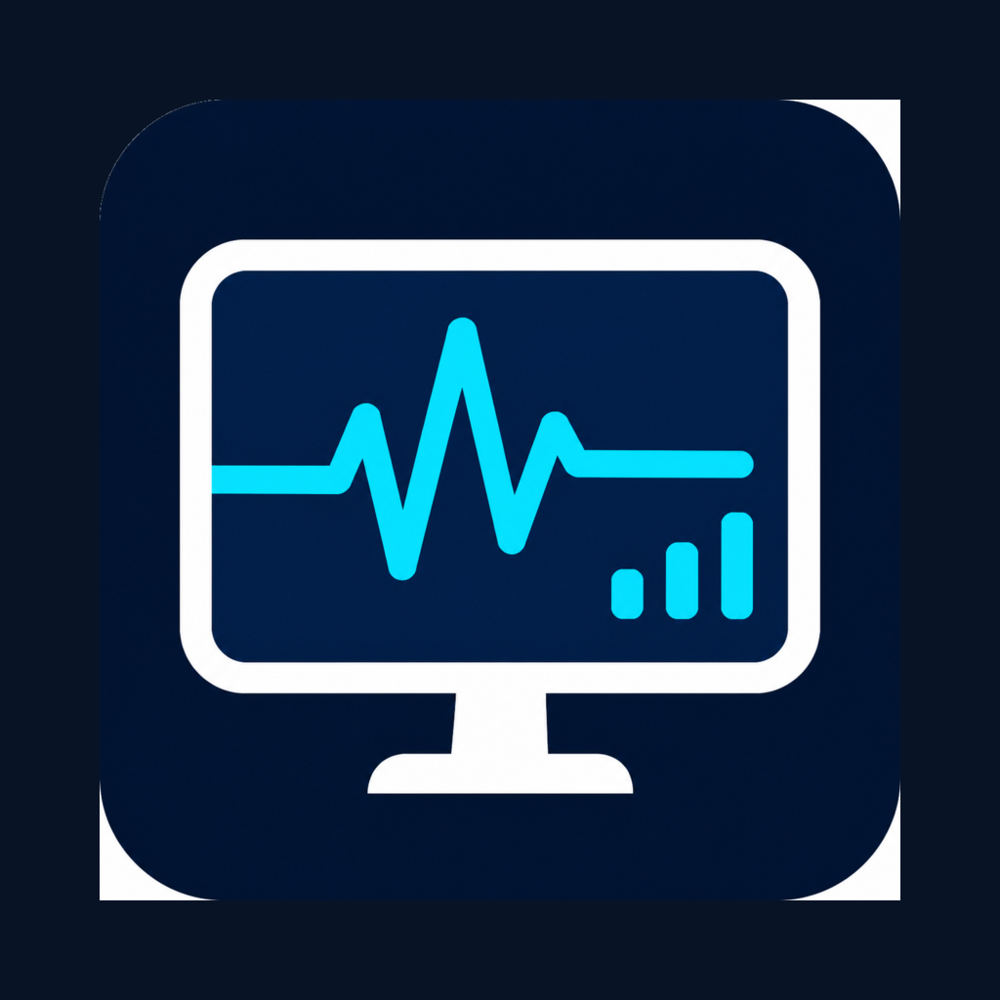

<div align="center">
  
  <h1>LAN PC Monitor</h1>
  <p>Understand your Windows PC's temperatures, usage, clocks, fans, and memory from another device on your local network.</p>

  <a href="https://github.com/sam-schonenberg/lan-pc-monitor/releases/latest"></a>
  <a href="LICENSE.txt"></a>
</div>

LAN PC Monitor combines a lightweight Windows monitoring service with a companion app. It turns hardware-specific sensor labels into readable names, keeps recent history locally, and offers live dashboards, charts, alerts, and load-session summaries.

Everything runs on your own network. There is no account, cloud backend, telemetry service, remote relay, or router configuration.

> [!IMPORTANT]
> The current API uses unencrypted HTTP and WebSockets without authentication. Install it only on a trusted local network. Never forward port `5005` or expose it to the internet.

## Download and install

### 1. Install the Windows monitor

[**Download the latest Windows installer from GitHub Releases**](https://github.com/sam-schonenberg/lan-pc-monitor/releases/latest)

Open the release's **Assets** section and download `LanPcMonitor-0.1.1-win-x64.msi`. Run the installer as an administrator. It installs:

- the background monitoring service;
- the notification-area companion;
- a Start Menu shortcut; and
- a Windows Firewall rule limited to the local subnet.

The setup completion page opens the PC's local pairing page. Windows may show an unknown-publisher warning while public code signing is not configured. See [Installer and updates](docs/INSTALLER.md) for detailed behavior and verification.

### 2. Install the companion app

Install **LAN PC Monitor** from Google Play when the listing is available. For private testing, use the testing link supplied by the developer in Play Console.

The Android app is only a viewer; the Windows monitor must be installed and running on the PC.

### 3. Connect

Keep the phone and PC on the same local network, open the app, and scan the QR code shown by the PC's setup page. You can also enter the PC address manually, for example:

```text
http://192.168.1.50:5005
```

Guest Wi-Fi isolation, VPN routing, or another firewall can prevent devices on the same Wi-Fi from reaching each other.

## What you get

- Human-readable CPU, GPU, memory, fan, power, voltage, and temperature labels.
- Live readings updated about once per second.
- A customizable dashboard with current values, graphs, and alerts.
- Local minute-by-minute history with hour, day, and longer-range charts.
- Sustained temperature warnings and critical alerts with hysteresis.
- CPU/GPU load-session detection and per-session statistics.
- Offline access to history already synchronized to the app.
- Local storage with configurable retention and no telemetry.

The exact sensor set depends on the PC's hardware, drivers, permissions, and [LibreHardwareMonitor](https://github.com/LibreHardwareMonitor/LibreHardwareMonitor) support.

## How it works

| Component | Role |
|---|---|
| Windows service | Reads hardware sensors, records history, evaluates alerts, and exposes the LAN API. |
| Android/MAUI app | Displays live readings, dashboards, alerts, and synchronized offline history. |
| Tray companion | Opens the monitoring page and controls, enables, disables, or uninstalls the service. |

Monitoring data is stored under `%ProgramData%\LanPcMonitor` on the PC. The app keeps synchronized history and preferences in its private local database. Process monitoring retains only normalized process names such as `game.exe` and aggregate CPU statistics during detected load sessions—never paths, command lines, window titles, documents, memory contents, or network activity.

Read the full [security model](docs/SECURITY.md) before using the service on a shared or untrusted network.

## Requirements

For normal use:

- x64 Windows 10 or Windows 11 for the monitoring service;
- an Android device for the companion app; and
- both devices on the same reachable local network.

For development:

- [.NET 10 SDK](https://dotnet.microsoft.com/download/dotnet/10.0);
- the .NET MAUI Android workload for Android builds; and
- administrator access for service and firewall testing.

## Developer quick start

```powershell
git clone https://github.com/sam-schonenberg/lan-pc-monitor.git
cd lan-pc-monitor
dotnet restore .\PCMonitor.Service.slnx
dotnet run --project .\PCMonitor.Service\PCMonitor.Service.csproj
```

The service listens on all local interfaces on port `5005` by default. Useful local endpoints:

- Setup and pairing: <http://localhost:5005/setup>
- Service status: <http://localhost:5005/status>
- Current sensors: <http://localhost:5005/api/sensors>
- Complete route reference: [API documentation](docs/API.md)

Use `http://`, not `https://`; TLS is not configured in this release.

### Build and test

```powershell
dotnet build .\PCMonitor.Service.slnx --configuration Release
dotnet test .\PCMonitor.Service.Tests\PCMonitor.Service.Tests.csproj
dotnet test .\PCMonitor.Application.Tests\PCMonitor.Application.Tests.csproj
```

Build the Android client alone with:

```powershell
dotnet build .\PCMonitor.Application\PCMonitor.Application.csproj -f net10.0-android
```

Build the self-contained Windows MSI with:

```powershell
.\scripts\build-installer.ps1 -Version 0.1.1
```

Release maintainers should follow the [release checklist](docs/RELEASING.md).

## Configuration

Service settings live in [`PCMonitor.Service/appsettings.json`](PCMonitor.Service/appsettings.json).

| Section | Controls |
|---|---|
| `Monitoring` | Hardware polling interval. |
| `SessionDetection` | CPU/GPU load thresholds and timing. |
| `HistoricalMonitoring` | Bucket duration, retention, and API limits. |
| `ProcessMonitoring` | Dominant-process sampling during load sessions. |
| `Alerts` | Temperature thresholds, hysteresis, and retention. |
| `Server` | LAN API port; default `5005`. |
| `Setup` | Optional app-store links on the pairing page. |

If you change the service port, update the firewall rule to match:

```powershell
.\scripts\install-firewall-rule.bat 5010
```

## Current limitations

- The monitoring service is Windows-only and the installer is x64-only.
- The LAN API has no authentication, pairing authorization, TLS, or rate limiting.
- QR setup uses the PC's current private IP address; automatic mDNS rediscovery is not implemented.
- A sudden crash can lose the unfinished current history bucket.
- Windows packages are not yet Authenticode-signed.
- Updates are installed manually; there is no in-app update checker.

## Documentation

- [API reference](docs/API.md)
- [Installer and updates](docs/INSTALLER.md)
- [Security and safe deployment](docs/SECURITY.md)
- [Release checklist](docs/RELEASING.md)
- [v0.1.1 release notes](docs/RELEASE_NOTES_0.1.1.md)

## Contributing

Focused issues and pull requests are welcome. Keep the API backward-compatible where practical, add tests for behavioral changes, and do not introduce telemetry or outbound services without an explicit design discussion and opt-in model.

Report security concerns privately through GitHub Private Vulnerability Reporting rather than a public issue.

## License

Copyright © 2026 Schonenberg Developments. Distributed under the [MIT License](LICENSE.txt).
